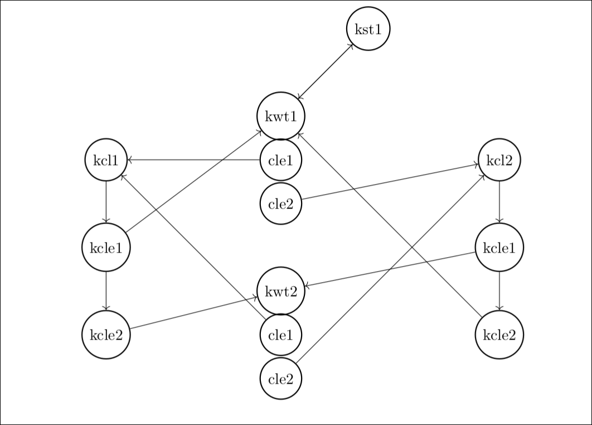

# AOSV Final Project Report
_A.Y. 2020/2021_

Author(s): Lorenzo Santangelo (1795872)

# Introduction
This project was developed for and tested on linux kernel 5.4.121 with Voluntary Kernel Preemption.

In the project there are three foundaumental entities: The UMS scheduler, or simply scheduler thread, the worker thread and the completion list.

The core idea of the project is to have for every of these entities a user space and a kernel space data structure, and a common structure between the two. This common structure have at least one field, a unique identifer among the entity. In this way we can reference kernel objects from userpsace and viceversa. The only exception is the scheduler thread that has only the kernel counterpart, but the only reason is because is not necessary to mantain the user space scheduler thread data in a data structure.

# Comunication with the kernel
Every comunication done from the library to the kernel module is done via ioctl(). It has been chosen since it is flexible and can be easily extended by adding new commands. An ioctl base interface fits the needs of the project since we don't have to transfer large amounts of data, othrewise we would have to use netlink socket or mmap.

# Wake up and put to sleep process
Frequently in the project a process must wait for an event, or signal that the event has happend.

To wait for an event a process put itself to TASK_INTERRUPTIBLE, and check wether the event has happend. If it happend then put itself to TASK_RUNNING, else call schedule() to indicate voluntarily to the scheduler that it can schedule some other process on the processor. To signal that the event happend to the process it is necessary to retrieve the task_struct of the process given its pid, and then call wake_up_process. This mechanism is used for example when a worker thread yields and have to inform the scheduler about it.

In case of more than one threads wants to wait for an event a wait queue is used, instead. In the project this happend when a scheduler waits for the completion_list to have available some ready woker threads. Each kcompletion_list store a wait queue. When there aren't any ready worker threads a scheduler calls wait_event_interruptible(). When a scheduler received is waken up from a worker threads, awakens the schedulers that are waiting for more ready worker threads.

# Overview of the kernel data structures
Below there is a directed graph where kwt, stands for kworker_thread, kst for ksched_thread, kcle for kcompletion_list_elem, cle for completion_list_elem and kst for ksched_thread.

If there is an directed edge from nodes1 to nodes2, means that the data structure node1 have a reference, an identifier, of node2. This means that node1 can retrieve a pointer of node2 given its identifier.

From a kcompletion_list we can retrieve a pointer to a kworker_thread, this is needed when we have to retrieve the ready worker threads.

From a kworker_thread we can retrieve a pointer to kcompletion_list, and it is needed when we have to wake up the schreduler waiting for the completion list to have worker threads available.

A scheduler and a worker thread mantains a reference to each other. The reason is  because a scheduler have to wake up a worker thread when the scheduler have to put the worker in execution, while the worker have to wake up the scheduler when it yields or finish the execution.

# User Space Point of View
The user of the library have to first allocate the userspace data structures, worker_thread and completion_list, and call functions of the library to initialize them and create the related kernel space data structures. Then it is necessary to call pthread_create for every scheduler thread and set as entry point of the pthread_t EnterUmsSchedulingMode, passing the appropriate argumments including the scheduler function.

In the scheduler function the scheduler can call DequeueUmsCompletionListItems, that returns an array of identifiers of worker threads that are ready, and the number of threads returned. For each thread returned the user must retrieve the worker_thread structure from the completion_list via completion_list_get(), and then call ExecuteUmsThread.

# Kernel Space Point of View
The kernel data structures are stored in hashtables, this is need it since we often have to retrieve a pointer to that structure given an identifier. So the creation of the data structures consists basically of allocate them, initialize them and add them to the right hashtable.

The core of the kernel module is the handling the ioctl requests. The most important requests are three: DEQUEUECOMPLLIST, EXECUTEUMSTHREAD and UMSTHREADTYIELD.

In DEQUEUECOMPLLIST, the calling thread access the kcompletion_list, and loop trough it. For each kcompletion_list_elem in the list, it get a pointer to a kworker thread and tries to lock it. If it is successful then it copies the identifier of the worker thread in the array that will be copyied back to the user space. In case the number of kworker_thread locked is zero the thread put itself in sleep. For each kcompletion list we have a counter that keeps track on how many threads can still be put in execution, nthreads. If nthreads is zero the then the number of threads copied is set to -1.

In EXECUTEUMSTHREAD, the thread retrieve the kworker_thread and the ksched_thread via identifier, set the states of both to running via macros and wakes up the worker_thread. After waking up the worker the thread put itself to sleep, the thread will be awaken by a worker thread once it yields or finish the execution. 

Once this happend the ksched_thread state again to idle, and for each list where the worker thread is present, increment a counter in the kcompletion_list that keeps track of how many worker threads are ready. To do this it is necessary to loop trough a list of completion_list_elem stored in the kworker_thread. From the completion_list_elem it is possible to retrieve the completion lists.

Finally it awekens the scheduler threads waiting in DEQUEUECOMPLLIST, and unlock the kworker_thread mutex.

In UMSTHREADTYIELD the kworker_thread pointer is retrieved, the state is changed to idle, and the scheduler thread is aweken. After this the worker thread put itself in sleep. When a worker thread finish its execution instead of UMSTHREADYIELD, a WORKERTHREADEXIT request wiil be made. The only difference with UMSTHREADYIELD is that the state is set to exiting, and for each list where the worker thread is present, nthreads is decremented.

# Results

To test the project a simple script has been written to be able to run the example program multiple times with different configurations:

* num of runs: the number the example program is executed
* num of worker threads: the total number of worker threads used in the program
* num of completion list: the total number of completion lists used in the program
* worker thread worker load: how many loops a worker thread will perform before yield or terminate
* number of yields: how many times a worker will yield
* elapsed time: the time needed to complete the test with the previous configurations

num of runs | num of worker threads| num of completion list | worker thread work load | number of yields | elapsed time(sec)
---|---|---|---|---|---
180 | 7 | 1 | 10000000 | 4 | 6.088363403
180 | 7 | 2 | 10000000 | 4 | 6.070148436

In this first test we can see that the addition of completion lists affects in a minor way the performances, this is intutive since having two completion lists, one for each scheduler, that share a lot of worker threads or all of them, is the almodt the same of having a completion list shared by the schedulers.

In this other test i focused on one single worker thread.

worker thread work load | number of yields | total running time (sec) | time needed for the last worker thread switch(sec) | time needed to complete the work load on the same machine(sec)
---|---|---|---|---
4000000000 | 2 | 18.745715932 | 9.372895649 | ~9

It is possible to observe that the time needed to yield and to switch context is <1s, this indicate that the library is at least usable, and for the purpose of this project is enough.

# Conclusions
Even tough the project has been tested various times using the script test.sh, the script itself is really simple and incomplete. The correctness of the project has not been proven and it is possible that it may be susceptible to race conditions.

The project may be improved in different ways, that due to time constraints wan't possible to apply. One example is to replace the array list in completion_list with an hashtable, or other data structures that allow the search in O(1) instead of O(n).

Another improvemnet would be to rely less on the indentifiers and on the functions get_*_thread(), but just use pointers to the structures. To do this would be necessary to restructure the project to avoid circular dependencies.

# References
* <https://www.linuxjournal.com/article/8144>